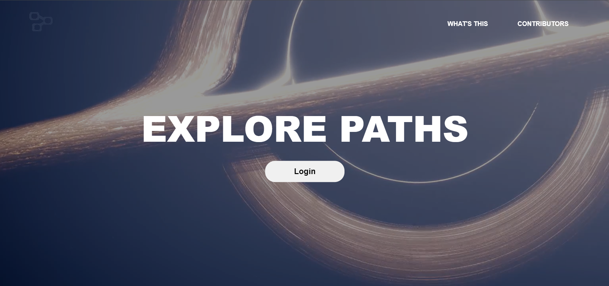
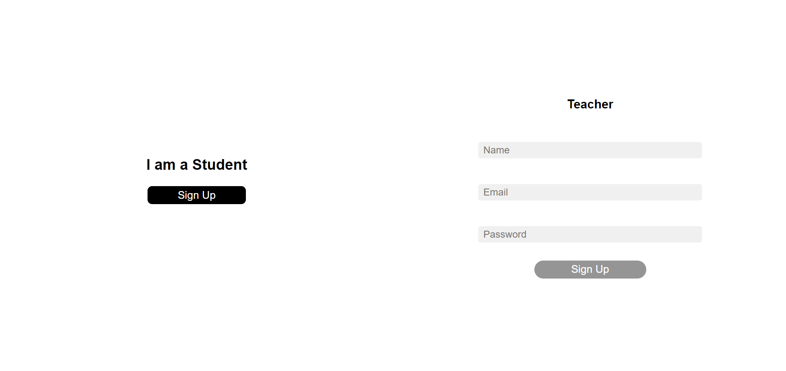
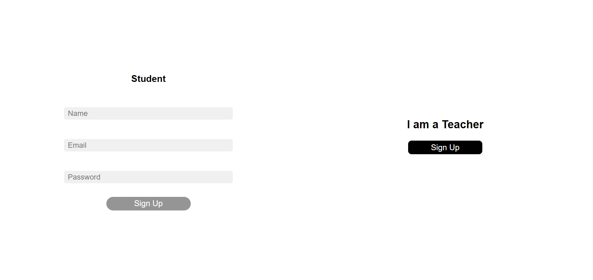
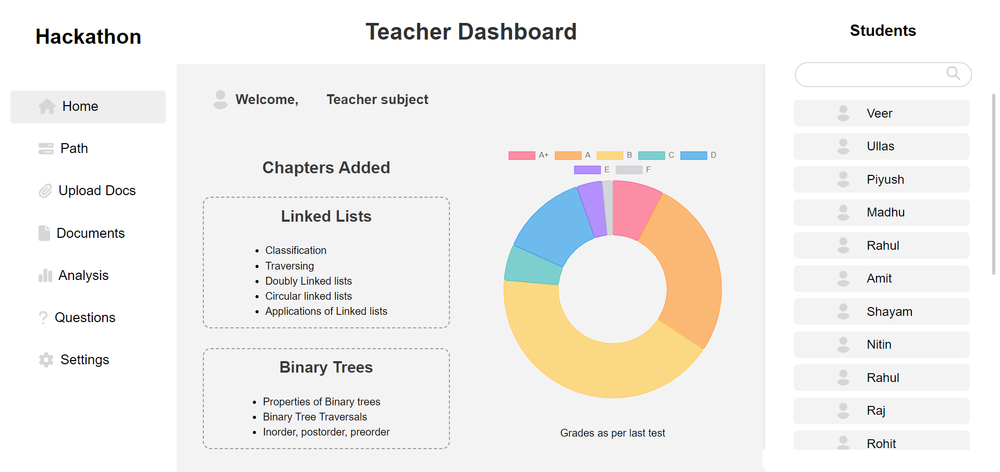
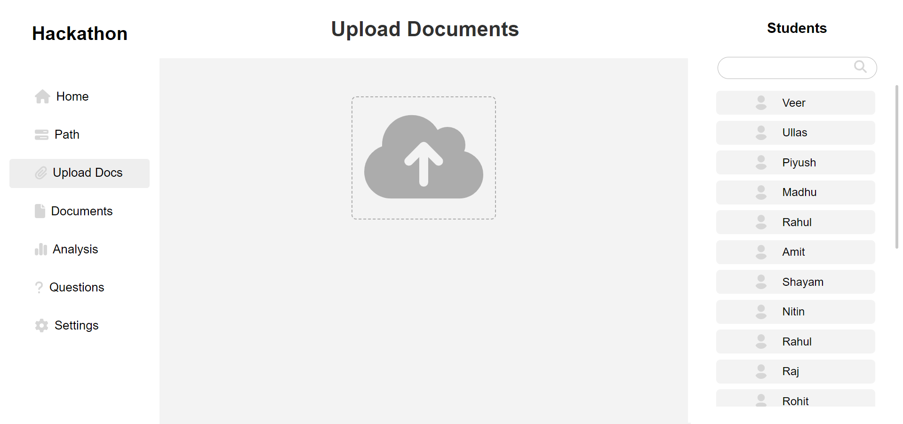
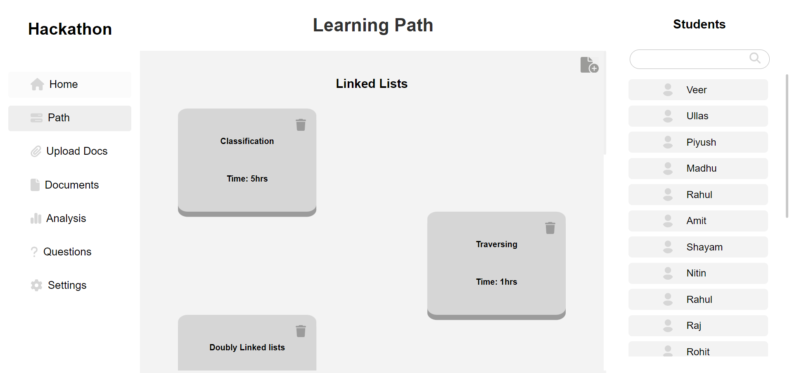
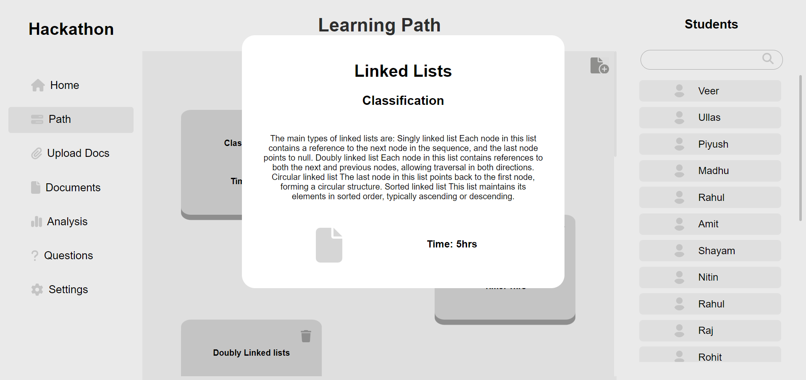
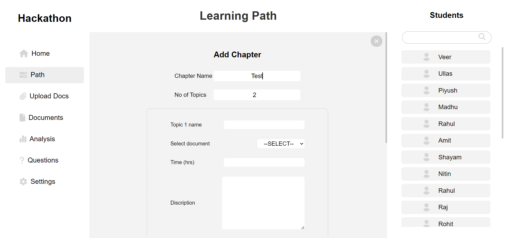
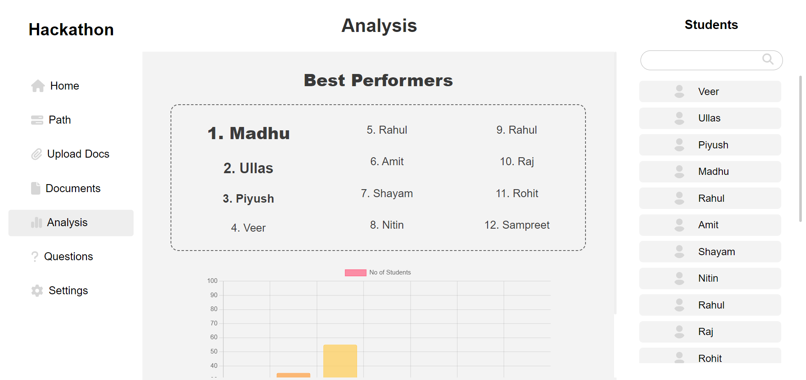
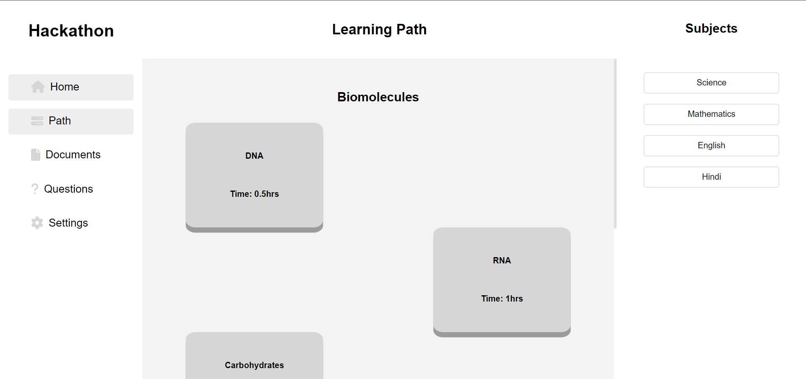

# SIH Hackathon Project - Educational Content Management Platform

## 📋 Project Overview

This is a Django-based web application developed for the Smart India Hackathon (SIH). The platform serves as an educational content management system that facilitates file processing, user management, and content delivery for educational institutions.

## 📸 Screenshots

### Authentication System

*Main login page for accessing the platform*


*Teacher-specific login interface*


*Student login interface*

### Teacher Dashboard & Features

*Teacher dashboard homepage with navigation and overview*


*File upload interface for teachers to upload educational content*


*Teacher interface for managing learning paths and content*


*Detailed view of learning path management*


*Advanced learning path configuration options*


*Analytics and progress tracking for teachers*

### Student Features

*Student interface showing available learning paths and courses*

## 🚀 Features

### Core Functionality
- **User Management**: Separate login systems for Students, Teachers, and Site Administrators
  - Multi-role authentication system as shown in our [login interfaces](Screenshots/login-page.png)
- **File Processing**: Support for multiple file formats including PDF, Excel (.xlsx), and BibTeX (.bib)
  - Demonstrated in our [file upload system](Screenshots/teachers-upload-file.png)
- **Content Management**: Chapter and topic organization system
  - Visible in our [learning path management](Screenshots/teacher-learning-paths.png)
- **File Upload System**: Secure file upload with storage management
- **Analytics & Tracking**: Comprehensive progress monitoring and analytics
  - Featured in our [teacher analytics dashboard](Screenshots/teachers-analysis.png)

### User Roles
1. **Students**: Access to educational content and materials
   - Student interface shown in [learning paths view](Screenshots/students-learning-paths.png)
2. **Teachers**: Content upload, chapter/topic management, and dashboard access
   - Teacher features demonstrated in [dashboard](Screenshots/teacher-dashboard-homepage.png) and [content management](Screenshots/teachers-learning-path-sample-2.png)
3. **Site Administrators**: Platform administration and oversight

### File Processing Capabilities
- **PDF Processing**: Text extraction and conversion to CSV format
- **Excel Support**: Reading and processing .xlsx files
- **BibTeX Parsing**: Academic reference processing
- **Automated CSV Generation**: Convert processed content to structured data

## 🛠️ Technology Stack

### Backend
- **Framework**: Django 5.1
- **Database**: SQLite (with dual database support)
- **API**: Django REST Framework 3.15.2
- **File Processing**: PyPDF2, pandas, bibtexparser

### Frontend
- **Templates**: Django Template System
- **Styling**: Custom CSS
- **Media Handling**: Django Static Files

### Dependencies
```
Django==5.1
djangorestframework==3.15.2
PyPDF2==3.0.1
pandas==2.2.2
bibtexparser==1.4.1
mysql-connector-python==9.0.0
gunicorn==23.0.0
```

## 📁 Project Structure

```
HPmain/
├── HPmain/                 # Main project configuration
│   ├── settings.py         # Django settings
│   ├── urls.py            # Main URL configuration
│   └── wsgi.py            # WSGI application
├── homepage/              # Landing page app
├── login_page/            # Authentication system
├── teacher/               # Teacher functionality
│   ├── models.py          # Chapter, Topic, UploadedFile models
│   ├── views.py           # Teacher dashboard, file upload
│   ├── forms.py           # File upload forms
│   └── serializers.py     # API serializers
├── student/               # Student portal
├── sadmin/                # Site administration
├── testing/               # Testing/development features
├── file_processing_test/  # File processing utilities
├── templates/             # HTML templates
├── static/               # Static files (CSS, JS)
├── media/                # User uploaded files
└── requirements.txt      # Python dependencies
```

## 🔧 Installation & Setup

### Prerequisites
- Python 3.8+
- pip (Python package manager)

### Installation Steps

1. **Clone the repository**
```bash
git clone <repository-url>
cd HPmain
```

2. **Create virtual environment** (recommended)
```bash
python -m venv venv
```

3. **Activate virtual environment**
```bash
# Windows
venv\Scripts\activate

# Linux/Mac
source venv/bin/activate
```

4. **Install dependencies**
```bash
pip install -r requirements.txt
```

5. **Database setup**
```bash
python manage.py makemigrations
python manage.py migrate
```

6. **Create superuser** (optional)
```bash
python manage.py createsuperuser
```

7. **Run development server**
```bash
python manage.py runserver
```

The application will be available at `http://localhost:8000`

## 🚀 Quick Start Guide

### 1. Access the Application
Navigate to `http://localhost:8000` to see the main login page:


### 2. Teacher Quick Start
- Login through the teacher portal
- Access your dashboard to upload content and manage learning paths
- Use the analytics features to track student progress

### 3. Student Quick Start  
- Login through the student portal
- Browse available learning paths and educational content
- Access your personalized learning materials

## 🌐 API Endpoints

### Authentication
- `GET /login/` - Login page
- `POST /login/teachinfo/` - Teacher login processing

### Teacher Features
- `GET /teacher/teachinfo/` - Teacher dashboard
- `POST /teacher/media/upload/` - File upload endpoint
- `GET /teacher/api/chapters/` - List chapters (API)
- `POST /teacher/api/chapters/` - Create chapter (API)

### Student Features
- `GET /student/` - Student portal

### File Processing
The application supports processing of:
- PDF files → Text extraction → CSV conversion
- Excel files → Direct CSV conversion
- BibTeX files → Reference data → CSV format

## 🗃️ Database Schema

### Core Models

**Teacher Model**
- name: CharField(max_length=100)
- email: EmailField(unique=True)
- password: CharField(max_length=128)

**Student Model**
- name: CharField(max_length=100)
- email: EmailField(unique=True)
- password: CharField(max_length=128)

**Chapter Model**
- name: CharField(max_length=255)
- topics: ManyToManyField(Topic)

**Topic Model**
- topic_name: CharField(max_length=255)
- topic_doc: CharField(max_length=255)
- topic_desc: CharField(max_length=255)
- topic_time: CharField(max_length=10)

**UploadedFile Model**
- file: FileField(upload_to='HPmain/media/uploads/')
- uploaded_at: DateTimeField(auto_now_add=True)

## 🔐 Configuration

### Environment Variables
The application uses environment variables for configuration:
- `SECRET_KEY`: Django secret key
- `DEBUG`: Debug mode (True/False)
- `ALLOWED_HOSTS`: Comma-separated list of allowed hosts

### Database Configuration
- Primary Database: SQLite (`db.sqlite3`)
- Secondary Database: SQLite (`userDB.sqlite3`)
- Support for PostgreSQL (commented configuration available)

## 📚 Usage

### For Teachers

#### 1. Login to Teacher Portal

Access the teacher portal through the dedicated login interface.

#### 2. Dashboard Overview

The teacher dashboard provides access to all teaching tools and content management features.

#### 3. Upload Educational Content

Upload various file formats (PDF, Excel, BibTeX) through the secure file upload system.

#### 4. Manage Learning Paths

Create and organize learning paths for students with structured content delivery.


Configure detailed learning paths with multiple topics and resources.

#### 5. Track Student Progress

Monitor student progress and analyze learning outcomes through comprehensive analytics.

### For Students

#### 1. Student Login

Access the student portal through the dedicated student login interface.

#### 2. Access Learning Paths

Browse and access organized learning paths and educational content.

### For Administrators
1. Access admin panel at `/admin/`
2. Manage users, content, and system settings

## 🧪 Testing

The project includes a testing module with video player functionality for content preview.

```bash
# Run tests
python manage.py test

# Access testing interface
http://localhost:8000/testing/
```

## 🚀 Deployment

### Production Checklist
- [ ] Set `DEBUG = False` in settings
- [ ] Configure proper `SECRET_KEY`
- [ ] Set up production database
- [ ] Configure static file serving
- [ ] Set up media file handling
- [ ] Configure allowed hosts

### Using Gunicorn
```bash
gunicorn HPmain.wsgi:application
```

## 🤝 Contributing

1. Fork the repository
2. Create a feature branch
3. Make your changes
4. Submit a pull request

## 📄 License

This project was developed for the Smart India Hackathon. Please refer to the competition guidelines for usage rights.

## 👥 Team

Developed for Smart India Hackathon by [Team Name]

## 📞 Support

For support and questions, please contact the development team or refer to the project documentation.

---

**Note**: This is a hackathon project and may require additional security measures and optimizations for production use.
